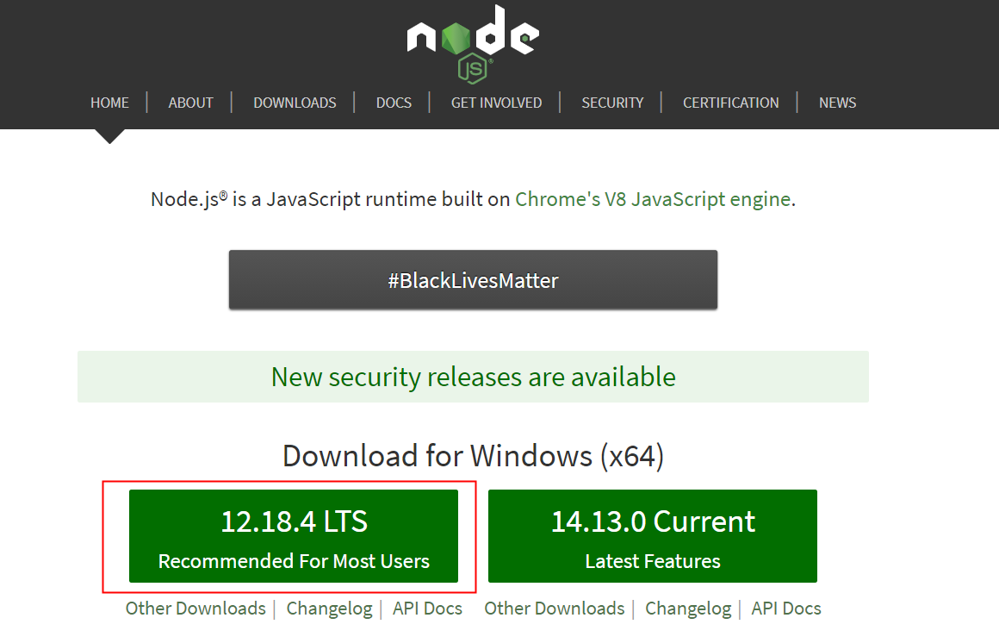

<!-- docs/chapter01/01/install-node.md -->

# 1.1.1 安装node

Windows 上安装 [node](https://nodejs.org/en) 可以采用msi安装包或二进制文件（.exe）安装；这里使用msi安装包进行安装说明；


选择长期支持版本，下载后一路next，最后finish即可完成安装；该本版node,安装完成后，会自动添加到PATH环境变量中；

命令行中输入: 
```bash
node -v 
```
检测是否安装成功。

