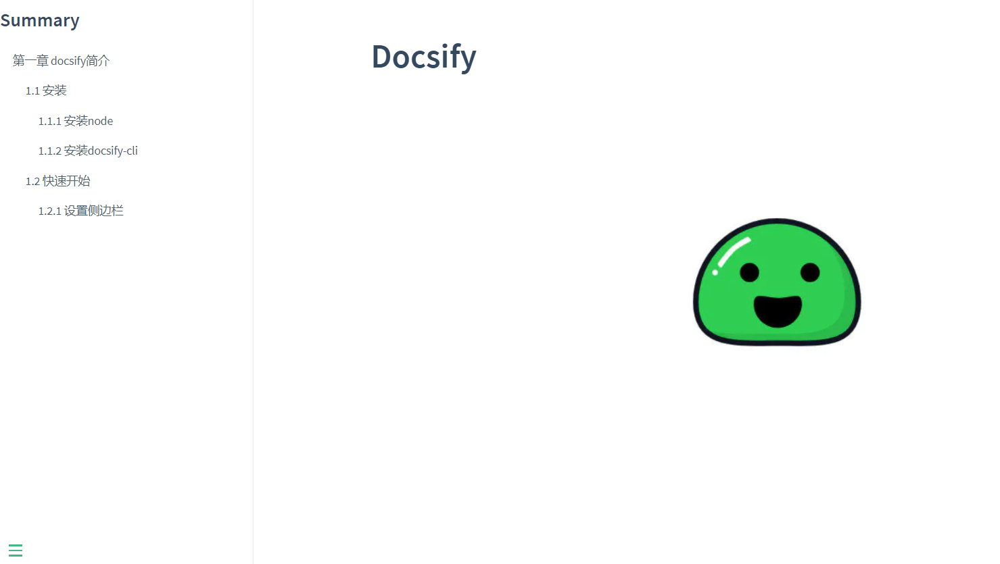

<!-- docs/chapter01/02/custom-sidebar.md -->

# 1.2.1 设置侧边栏

默认情况下，侧边栏会根据当前文档的标题生成目录。
为了访问主页时，在左侧能够生成目录树，我们可以定制侧边栏。

### 定制侧边栏
首先需要在index.html文件中的window.$docsify添加loadSidebar: true,选项：
```html
<body>
  <div id="app"></div>
  <script>
    window.$docsify = {
      loadSidebar: true,
      name: '',
      repo: ''
    }
  </script>
  <script src="//cdn.jsdelivr.net/npm/docsify/lib/docsify.min.js"></script>
</body>
```
接着在项目根目录创建**_sidebar.md**文件，内容格式如下：
```
# Summary
* [第一章 docsify简介](chapter01/brief.md)
  * [1.1 安装](chapter01/01/install.md)
    * [1.1.1 安装node](chapter01/01/install-node.md)
    * [1.1.2 安装docsify-cli](chapter01/01/install-docsify-cli.md)
  * [1.2 快速开始](chapter01/02/init.md)
    * [1.2.1 设置侧边栏](chapter01/02/set-sidebar.md)
```


**注：配置了loadSidebar后就不会生成默认的侧边栏了。**

参考：https://blog.csdn.net/weixin_33874713/article/details/88705987


